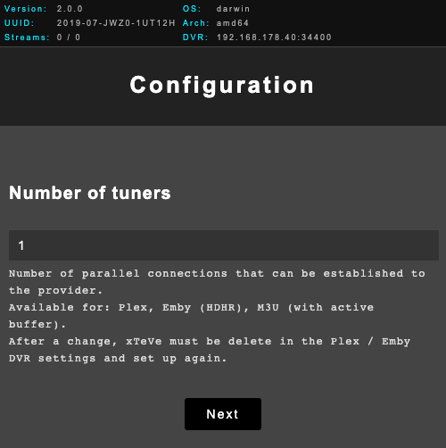
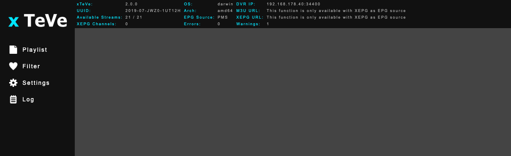
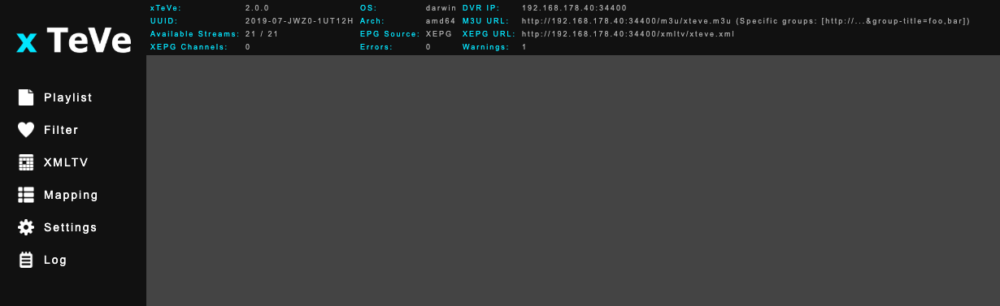
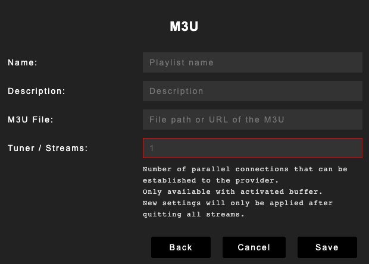
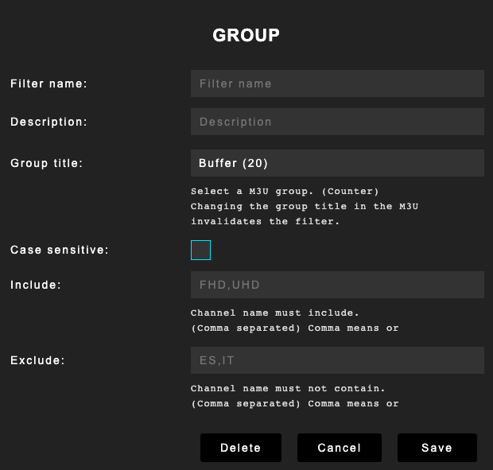
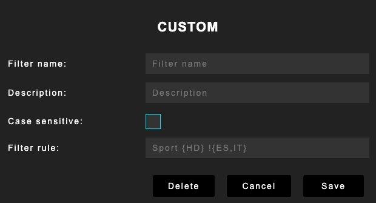
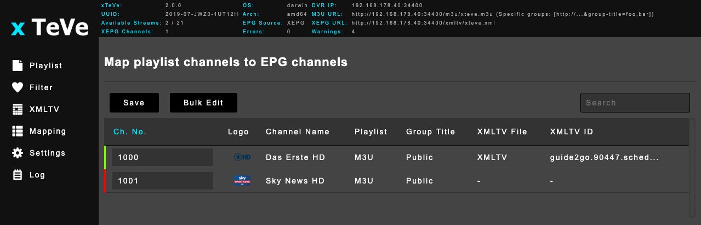
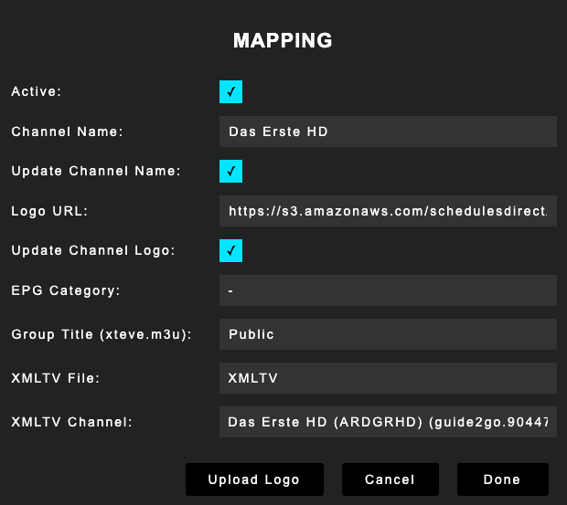
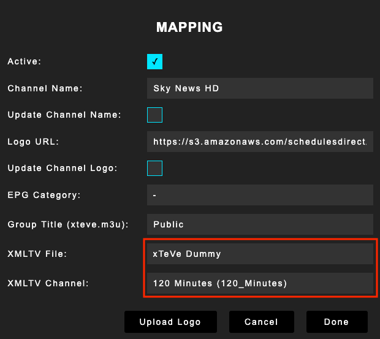

# xTeVe - Setup and configuration

## Setup
#### Run xTeVe
* [CLI-Options](#CLI-Options)
* [Windows](#run-on-windows)
* [Linux, OS X, FreeBSD](#run-on-other-operating-systems)
* [Console information](#console-information)

## CLI-Options
Arguments (If any) : 
1. -config=C:\PathToXteve\Config
2. -port="XXXX" (For XXXX use the port you desire)


#### xTeVe configuration

* [Initial configuration](#initial-configuration)
* [xTeVe Web interface](#web-interface)
* [Playlist](#playlist)
* [Filter](#filter)
* [XMLTV](#xmltv)
* [Mapping](#mapping)
* [Users](#users)
* [Settings](#settings)
* [Log](#log)

#### Migration from 1.4.4 to 2.x.x
* [Migration](#migration)

#### M3U
* [M3U Export](#m3u-export)

#### API Interface

* [API documentation](#api)

## Scripts
* [Linux startup script](scripts.md#linux-systemd)
* [FreeBSD startup script](scripts.md#freebsd-service)

## Troubleshooting

* [General](troubleshooting.md#general)
* [xTeVe](troubleshooting.md#xteve)
* [Plex](troubleshooting.md#plex)

## Run on Windows
xteve.exe is a binary file and needs to be started with a double click.

## Xteve as a Windows Service
1. Download NSSM from https://nssm.cc/release/nssm-2.24.zip
2. Unzip and copy NSSM to C:\windows\System32 folder
3. Open a command prompt
4. Use the following command: nssm install Xteve
5. Path C:\PathToXteve\xteve.exe
6. Startup directory C:\PathToXteve
7. Arguments (If any) : -config=C:\PathToXteve\Config or -port="XXXX" (For XXXX use the port you desire)
8. Click Install service.
9. From the command prompt run this command: nssm start Xteve
10. Xteve should now start as a service.

## Run on other operating systems
**Linux, OS X, FreeBSD**

The xTeVe binary must be started in the terminal.

- Open a terminal
- Change path to the binary

```
cd /path/to/xteve/folder/
```

- Set permission to execute the file

```
chmod +x xteve
```

- Start xTeVe

```
./xteve
```

## Console information
After starting xTeVe, all important information is displayed in the terminal

```
[xTeVe] Version:              2.0.0
[xTeVe] System IP Addresses:  IPv4: 2 | IPv6: 8
[xTeVe] Hostname:             xteve.local
[xTeVe] System Folder:        /home/USERNAME/.xteve/
[xTeVe] Load Settings:        /home/USERNAME/.xteve/settings.json
[xTeVe] Temporary Folder:     /tmp/xteve/2019-07-JWZ0-1UT12H/
[xTeVe] UUID:                 2019-07-JWZ0-1UT12H
...
[xTeVe] Web Interface:        http://192.168.178.40:34400/web/
...
```
**System IP Addresses:** Number of available IP addresses on this system. xTeVe can be reached via all IP addresses.  
**System Folder:** This folder stores all configuration files.  
**Temporary Folder:** This folder stores temporary files. Each instance of xTeVe has its own serial number and creates its own temporary folder.  
**UUID:** Serial number of the xTeVe instance.  
**Web Interface:** This is the URL / link through which the xTeVe web interface can be accessed. Any other IP address or hostname of the computer can be used.

## Initial Configuration
- Start a browser
- Open the link that appears in the xTeVe console

```
...
[xTeVe] Web Interface:        http://192.168.178.40:34400/web/
...
```

### Configuration wizard


#### Number of tuners
xTeVe emulates a DVR tuner for Plex and Emby.  
The number of tuners determines how many concurrent streams are available. Some streaming providers allow only a certain number of parallel streams, then this value should be selected.

#### EPG Source
Selection of the EPG (Electronic Program Guide) source.

**PMS:**

- xTeVe does not process EPG data
- The configuration of the EPG data is done by Plex / Emby

**XEPG:**

- xTeVe provides the EPG data as an XMLTV file.
- At least one XMLTV file must be specified as the source.
- Channel management
- xTeVe creates a M3U playlist for other video players like VLC etc.

#### M3U Playlist
Specify an M3U playlist, local or from a web server.  

Local path:

```
/path/to/playlist.m3u
```

Web server:

```
http://example.com/playlist.m3u
```

#### XMLTV File
**Only available with XEPG**
Specify an XMLTV file, local or from a web server.  

Local path:

```
/path/to/xmltv.xml
```

Web server:

```
http://example.com/xmltv.xml
```

## Web interface

### EPG source: PMS


### EPG source: XEPG


#### Overview xTeVe
**xTeVe:** Version number  

**UUID:** Serial number of the xTeVe instance  

**Available Streams:** Available streams / All streams  
If the available streams are 0, the limit of 480 is exceeded and the [filter](#filter) must be used.  

**XEPG Channels:** Active channels that have been assigned to an XMLTV file in the Mapping menu. (XEPG only)  

**OS:** Operating system  

**Arch:** Processor architecture  

**EPG Source:** [Source](#general) for the EPG data (PMS or XEPG)  

**DVR IP:** DVR tuner address. Required by Plex and Emby (HDHR)  

**M3U URL:** HTTP URL of the M3U playlist for other video players like VLC etc. (XEPG only)  

**XEPG URL:** XMLTV URL for Plex, Emby or other IPTV Apps. (XEPG only)  

**Download as GZIP:** `http://xeteve.ip:34400/xmltv/xteve.xml.gz`  
The IPTV client must support GZIP for EPG data (**Plex does not support GZIP**)

**Errors:** Errors that have occurred. Are displayed in the [log](#log).  

**Warnings:** System warnings. Are displayed in the [log](#log).  

## Playlist
Supported are M3U playlists and HDHomeRun tuners

#### Overview Playlist
**Playlist:** Playlist name  

**Tuner:** Number of concurrent streams for this playlist. Only with activated [buffer](#streaming).  

**Last Update:** Playlist was last updated at this time.  

**Availability %:** Availability of the playlist. In percent.  

**Type:** Type of playlist (M3U or HDHomeRun).  

**Streams:** Number of streams in this playlist.  

**group-title %:** Streams associated with a group in the playlist. In percent.  
The M3U parameter is called `group-title="Group name"`.  
Streams assigned to a group can be filtered more easily.  

**tvg-id %:** Streams that have a reference to an XMLTV channel. In percent.  
The M3U parameter is called `tvg-id="example.com"`.  
Streams with this parameter are automatically assigned to an XMLTV channel in the Mapping menu. The automatic assignment is performed only new channels and also only once automatically.  

**Unique ID %:** Streams that have a unique ID can be assigned more reliably, even if the channel name changes. Helpful for streams where the channel name changes regularly. How this ID works is similar to a Database ID.  
There is no official parameter for it, in most cases the parameter is `CUID="1234"`, `channel-id="abcd"`.  
xTeVe analyzes each stream to find an ID, even if the parameter is different.  
If the stream does not contain this ID, the channel name is used for channel assignment. If the channel name changes during an update, this is a new channel for xTeVe and the old one will be deleted.  

#### Add new playlists
Click on **New** to add a new playlist or tuner.  

**Type**  

- M3U: M3U playlist
- HDHomeRun: HDHomeRun Tuner



**Name:** Name of the playlist  

**Description:** Description of the playlist  

**M3U File:** [URL](#m3u-playlist) or local [path](#m3u-playlist) of the playlist

**HDHomeRun IP:** IP address and port of the HDHomeRun tuner. The port may differ depending on the model and firmware.  

```
192.168.178.5:5004
```

**Tuner / Streams:** Number of concurrent streams for this playlist. Only with **activated** [buffer](#buffer).  
When the limit is exceeded, no connection is established to the streaming server / provider. The client (Plex, Emby, xteve.m3u) receives an error message as a video stream.  


#### Edit playlist
By clicking on a playlist in the overview this can be edited.

**Save:** Save this playlist  

**Update:** Playlist is being updated

**Cancel:** Cancel

**Delete:** Delete this playlist

## Filter
To reduce the number of streams, filter rules can be created.  
There are two types of filters: 

- [Group Filter](#group-filter): Based on the groups titles from the M3U (`group-title="Group name"`)  
- [Custom Filter](#custom-filter): Analyzes all M3U parameters, based on the values filter rules can be created.

#### Overview Filter
**Filter Name:** Filter name  

**Filter Type:** Filter Type (Group or Custom)  

**Filter:** Filter rule

#### Create a new filter
Click on **New** to add a new filter.  

**Type**  

- M3U: Group Title
- xTeVe: Custom Filter

#### Group Filter




**Filter Name:** Filter name  

**Description:** Description

**Group Title:** Select a group or HDHomeRun tuner. Only one group / tuner can be selected at a time. For another group a new filter has to be created.  
The number in bracket indicates how many streams are in this group.

**Case Sensitive:** Case sensitive

**Include:** The channel name must contain one of these words.  
Separated by a comma, several words can be specified. One of these words must be included for this channel to be used.  

**Exclude:** The channel name can not contain any of these words.  
Separated by a comma, several words can be specified. If one of these words is included, this channel will be singled out.

#### Custom Filter



**Filter Name:** Filter name  

**Description:** Description

**Case Sensitive:** Case sensitive

**Filter Rule:** Filter Rule  

Example of an M3U playlist:
```
#EXTM3U
#EXTINF:-1 CUID="1000" tvg-id="news.channel.1" tvg-name="News Channel 1" tvg-logo="http://example.com/logo1.jpg" group-title="UK: News",News Channel 1 HD
http://example.com/stream1.ts

#EXTINF:-1 CUID="1001" tvg-id="news.channel.2" tvg-name="News Channel 2" tvg-logo="http://example.com/logo2.jpg" group-title="UK: News",News Channel 2 SD
http://example.com/stream2.ts

#EXTINF:-1 CUID="1002" tvg-id="news.channel.3" tvg-name="News Channel 3" tvg-logo="http://example.com/logo3.jpg" group-title="US: News",News Channel 3 HD
http://example.com/stream3.ts

#EXTINF:-1 CUID="1003" tvg-id="sports.channel.1" tvg-name="Sports Channel 1" tvg-logo="http://example.com/logo4.jpg" group-title="UK: Sports",Sports Channel 1 HD
http://example.com/stream4.ts


```

xTeVe analyzes all the M3U parameters of each stream and puts the values together. URLs are excluded.  
The values of the streams would look like this:

```
Stream 1:
1000 news.channel.1 News Channel 1 UK: News News Channel 1 HD

Stream 2:
1001 news.channel.2 News Channel 2 UK: News News Channel 2 SD

Stream 3:
1002 news.channel.3 News Channel 3 US: News News Channel 3 HD

Stream 4:
1003 sports.channel.1 Sports Channel 1 UK: Sports Sports Channel 1 HD
```

A filter rule for all news channels would look like this:

```
News
```

Since the word `News` is contained in several M3U parameters of streams 1, 2, 3, only these three streams are filtered.  

---

Three of these streams contain `UK:` in the M3U group title. To filter all streams that contain `UK:` the filter rule would look like this:

```
UK:
```

---

To specify further conditions, braces can be used.

> Include {VIP,HD}  
> Exlude !{ES,FR}

If you only want to filter **News** channels that are marked as **HD**, the rule would look like this:

```
News {HD}
```
Stream 1 and 3 are now available

To exclude the US channel, the filter rule would look like this:

```
News {HD} !{US}
```

Stream 1 are now available

---

Bad idea of a filter rule:

```
!{That's,not,a,good,idea,for,a,filter,rule}
```

Any stream containing one of these words will be removed. Since the letter `a` is included in the word Ch**a**nnel, no stream will be available.

## XMLTV
**Only available with XEPG**

XMLTV files with UTF-8 encoding are supported. An XMLTV file is an XML file containing EPG (Electronic Program Guide) data.  

#### Overview XMLTV
**Guide:** Guide name  

**Last Update:** Guide was last updated at this time.  

**Availability %:** Availability of this file. In percent.  

**Channels:** Available channels in this file.

**Programs:** Number of program information in this file.

#### Add new XMLTV file
Click on **New** to add a new XMLTV file.


**Name:** Name of the guide  

**Description:** Description of the guide  

**XMLTV File:** [URL](#xmltv-file) or local [path](#xmltv-file) of the XMLTV file

#### Edit XMLTV file
By clicking on a guide in the overview this can be edited.

**Save:** Save this XMLTV file  

**Update:** XMLTV file is being updated

**Cancel:** Cancel

**Delete:** Delete this XMLTV file

## Mapping
**Only available with XEPG**

The mapping function allows you to edit the channels from the playlists.  
Only active channels (green) are passed to Plex, Emby and the xteve.m3u playlist.
For a channel to be active, it must be assigned to an XMLTV channel. New channels e.g. new filter rules automatically assign an XMLTV file if the IDs from the M3U and XMLTV file match.

> tvg-id (M3U) == channel id (XMLTV)

New channels get the first free channel number after 1000.

If no EPG data is available for a channel, the [xTeVe Dummy](#xteve-dummy) can be used.



**Save:** All settings of the channels are saved and xTeVe generates the DVR lineup, the xteve.xml and xteve.m3u file. Creating these files is done in the background and can take a few seconds.  

**Bulk Edit:** Allows editing multiple channels with the same settings e.g. EPG categories.  

**Search:** The following terms can be searched.  

- Channel name
- Channel position
- Group title
- Categories
- XMLTV file
- Channel status (online / offline)

**Featured:**  

- Change the channel number and thus the order of the channels in Plex, Emby and the M3U (xteve.m3u). By clicking on the channel number, it can be changed.
- Change the channel logo
- Change channel name
- Change the group title for the xteve.m3u playlist
- Add another EPG category
- Assign the playlist channel to an XMLTV channel

By clicking on a channel, the editing mode opens for this channel.



**Active:** Channels can only be activated if an XMLTV file / channel is assigned.  

**Channe Name:** Changing the channel name, if the name contains **HD**, all programs of this channel in the xteve.xml file are declared as HD.  

**Channel Description:** This entry is also adopted by the [xTeVe Dummy](#xteve-dummy) as a programm description in the xteve.xml file.  
xteve.xml:
```XML
<programme channel="1000" start="20191213020000 +0100" stop="20191213040000 +0100">
    <title lang="en">Das Erste HD (Fr. 02:00 - 04:00)</title>
    <desc lang="en">This is a description of this channel</desc>
    ...
</programme>
```

If no value is entered, a default value is used.  
xteve.xml (default description):
```XML
<programme channel="1000" start="20191213020000 +0100" stop="20191213040000 +0100">
    <title lang="en">Das Erste HD (Fr. 02:00 - 04:00)</title>
    <desc lang="en">xTeVe: (120 Minutes) Friday 02:00 - 04:00</desc>
    ...
</programme>
```

**Update Channel Name:** If the channel name of the stream in the playlist changes, the channel name is updated automatically. This feature is only available if the stream in the playlist has a [unique ID](#overview-playlist).  

**Logo URL:** Change the channel logo with an image URL. By clicking on the **Upload Logo** button you can also upload your own logo. xTeVe then provides these via its own web server.  

**Update Channel Logo:** Updates the channel logo with every update of the playlist and XMLTV file. First priority is the XMLTV file, if it does not contain a logo for this channel, the logo from the M3U will be used.

**EPG Category:** Add another category for this channel. All program information is extended with this category, existing categories are retained. Plex supports the following categories:

- News
- Movie
- Series
- Sports

If no category is specified in the Provider XMLTV file, it is a movie for Plex.

**Group Title:** Declare a group for this channel in the xteve.m3u  
> xteve.m3u - M3U parameter: group-title="THIS_GROUP_TITLE"

**XMLTV File:** Selection of the XMLTV file  

**XMLTV Channel:** Selection of the XMLTV channel   

By clicking on the Done button, the settings are accepted, but not yet saved.

---

A text editor can be used to check whether the provider already supports categories by opening the XMLTV file.

XMLTV example:

```XML
<?xml version="1.0" encoding="UTF-8"?>
  <tv source-info-url="http://schedulesdirect.org" generator-info-name="guide2go" source-info-name="Schedules Direct">
    <channel id="guide2go.90447.schedulesdirect.org">
        <display-name>ARDGRHD</display-name>
        <display-name>Das Erste HD</display-name>
        <icon src="https://s3.amazonaws.com/schedulesdirect/assets/stationLogos/s90447_h3_aa.png" height="270" width="360"></icon>
    </channel>
    <programme channel="guide2go.90447.schedulesdirect.org" start="20190608004300 +0000" stop="20190608004500 +0000">
        <title lang="de">Tagesschau</title>
        <sub-title lang="de">vom 08.06.2019, 02:43 Uhr</sub-title>
        <desc lang="de">Diese Sendung berichtet über die aktuellsten und wichtigsten Nachrichten der Bundesrepublik.&#xA;[vom 08.06.2019, 02:43 Uhr]</desc>
        <category lang="en">News</category>
        <category lang="en">Politics</category>
        <category lang="en">Weather</category>
        <episode-num system="original-air-date">2019-06-08</episode-num>
        <icon src="https://s3.amazonaws.com/schedulesdirect/assets/p10414016_b_v8_aa.jpg" height="720" width="480"></icon>
        <icon src="https://s3.amazonaws.com/schedulesdirect/assets/p10414016_b_h10_aa.jpg" height="540" width="960"></icon>
        <video>
            <quality>HDTV</quality>
        </video>
        <audio>
            <stereo>dolby digital</stereo>
        </audio>
        <new></new>
        <live></live>
    </programme>
  </tv>
```

#### xTeVe Dummy
The xTeVe dummy generates EPG data for the next 5 days. Thus, it is possible to assign channels for which no EPG data is available. As program information, the channel name and the set program length are used.




## Users
Different functions can be locked by user authentication and permissions. For this menu item to be available, this function must first be activated in the [settings](#authentication). New users can be added via the **New** button. The first user who has been set up can not be deleted and always has the authorization WEB

By clicking on a user name, password and permissions can be changed.
The following authorizations for the selected user are possible:

- WEB: Allows login into the xTeVe web interface
- PMS: Allows the loading of the DVR Linups, this function only supports Plex. The credentials will be added to the DVR address.
> DVR IP: username:password@192.168.178.40:34400

- M3U: Allows you to download the xteve.m3u playlist. The credentials will be added to the M3U URL.
> M3U URL: http://192.168.178.40:34400/m3u/xteve.m3u?username=xxx&password=yyy

- XML: Allows you to download the xteve.xml file. The credentials will be added to the XEPG URL.
> XEPG URL: http://192.168.178.40:34400/xmltv/xteve.xml?username=xxx&password=yyy

- API: Allows access to the [API](#api) interface.

**Save:** Save the user settings  

**Cancel:** Cancel, changes are not saved  

**Delete:** Delete the user  

## Settings

#### General
- **Automatic update of xTeVe:** It is checked regularly, if a new version is available. An update will be installed automatically. xTeVe requires write permission for the folder in which the binary is located. The updates are downloaded from GitHub.

- **Number of tuners:** Number of tuners provided by xTeVe. Used by Plex, Emby HDHR and xteve.m3u (with buffer enabled only). If the buffer is activated, the tuner limit for each playlist / tuner can be set separately. The tuner limit should then be the sum of all tuner limits in the playlist.

- **EPG Source:** Selection of the EPG (Electronic Program Guide) source.

- **API Interface:** Activates the [API](#api) interface  

#### Files
- **Schedule for updating:** Time at which all playlists, tuners and XMLTV files should be updated.

- **Updates all files at startup:** Updates all playlists, tuners and XMLTV files when xTeVe starts.

- **Location for the temporary files:** Path in which the temporary files are stored.

- **Image caching:** All required images from the XMLTV files are downloaded and saved. Enables faster EPG queries by the client.

- **Replace missing program images:** If there is no poster in the XMLTV file, the channel logo will be used.

#### Streaming
- **Stream Buffer:** With activated buffer, the streams are buffered and forwarded to the clients unchanged. FFmpeg, VLC or xTeVe can be selected as a buffer. xTeVe monitors all client connections and allows re-streaming, so that multiple clients can request the same stream and it is only one connection to the provider.
For FFmpeg and VLC, the common program must be installed and the path to the program specified.
```
Streaming Server (Provider) --> (xTeVe / FFmpeg / VLC) --> Plex / Emby / xteve.m3u
```
If the buffer is disabled, only the streaming URL is passed to the client. xTeVe is then no longer involved.

- **Buffer Size:** Size of the buffer. If the size of an HLS segment smaller than the buffer size, the size will be used by the HLS segment.  

- **Timeout for new client connections:** xTeVe waits for the set time before new connections are allowed. Helpful for fast channel switching.

- **User Agent:** Defines which user agent should be in the header of an HTTP connection and buffer.  

- **FFmpeg Binary Path:** File path to FFmpeg.  

- **FFmpeg Options:** FFmpeg options, with the default settings no stream is transcoded only remuxing. Further parameters are available [here.](https://ffmpeg.org/ffmpeg.html)  

- **VLC Binary Path:** File path to VLC or CVLC.  

- **VLC Options:** VLC options, with the default settings no stream is transcoded only remuxing. Further parameters are available [here.](https://wiki.videolan.org/Documentation:Command_line/) 

#### Backup
- **Location for automatic backups:** Location for automatic backups. xTeVe needs write permission for this folder

- **Number of backups to keep:** Number of backups to keep. Older backups are automatically deleted.

#### Authentication
- **WEB Authentication:** Access to the web interface only possible with credentials.
- **PMS Authentication:** Access to the DVR lineup only possible with credentials. This function only supports Plex.
- **M3U Authentication:** Access to the xteve.m3u playlist is only possible with credentials.
- **XML Authentication:** Access to the xteve.xml file is only possible with credentials.
- **API Authentication:** Access to the [API](#api) interface is only possible with credentials.

In the [user settings](#users), the user must be assigned the authorization.

## Log
Displays the xTeVe log and refreshes every 10 seconds. All entries are in RAM. The log is maximum 500 entries, older entries are deleted. The button **Empty Log** deletes the log, warnings and errors are reset.

---

## Migration
The binary must have the permission to execute.  

**Web Interface:**  
1. Make a backup of 1.4.4 (Settings -> Backup)  
2. Stop xTeVe 1.4.4  
3. Start xTeVe 2.x.x
4. Go through the wizard  
5. Restore the configuration of 1.4.4 (Setting -> Restore -> Select backup file)  


**Command line - CLI**  
1. Open a terminal  
2. Go to the folder where the xTeVe binary is located  
```
cd /path/to/xteve/folder/
```
3. Restore a backup file  
```
./xteve -restore /path/to/backup/xteve_backup_YYYYMMDD_HHMM.zip
```
4. Start xTeVe  

---

## M3U-Export
In the [settings](#settings), the EPG source must be set to XEPG.
All active channels in the Mapping menu are exported to an M3U playlist.
Group Title and channel name can be changed in the [Mapping](#mapping) menu.
The playlist can be downloaded via the following URL.

**Without user authentication:**  
```
http://xteve.ip:port/m3u/xteve.m3u
```

**With user authentication:**  
User must have authorization M3U.  
```
http://xteve.ip:port/m3u/xteve.m3u?username=xxx&password=yyy
```

**Export channels of a specific group:**  
In this example, only the active channels of group **foo** and **bar** are exported:  
```
http://xteve.ip:port/m3u/xteve.m3u?group-title=foo,bar
```

The same example with user authentication:  
```
http://xteve.ip:port/m3u/xteve.m3u?username=xxx&password=yyy&group-title=foo,bar
```


## API
With the API interface it is possible to send commands to xTeVe. To use the API, it must be enabled in the [settings](#general).  
All API requests are made via an HTTP request as JSON string in the body.  
A response comes only when xTeVe has finished the command.

If authentication of the API interface is activated, the first thing to do is to log in. The user needs the authorization [API].

#### API - Login

**Method:** POST
**Request:** With authentication
```JSON
{
  "cmd": "login",
  "username": "username",
  "password": "password"
}
```

**Response:**
```JSON
{
  "status": true,
  "token": "tYKJs7WPP3gDOyM_Ggh3El4ZB5tEcGk78oAxrdjw",
}
```
**token:** This is in one-time token, this is valid only once and only for 60 minutes. For each API request, the token must be specified and a new token is returned.

#### API - xTeVe Status

**Method:** POST  
**Request:** With authentication  
```JSON
{
  "cmd": "status",
  "token": "tYKJs7WPP3gDOyM_Ggh3El4ZB5tEcGk78oAxrdjw"
}
```

**Response:**
```JSON
{
  "epg.source": "XEPG",
  "status": true,
  "streams.active": 2,
  "streams.all": 21,
  "streams.xepg": 2,
  "token": "IRRJDevtK4s7ec4-3gLw7uswtCVqC9DWngH4Jxzv",
  "url.dvr": "192.168.178.40:34400",
  "url.m3u": "http://192.168.178.40:34400/m3u/xteve.m3u",
  "url.xepg": "http://192.168.178.40:34400/xmltv/xteve.xml",
  "version.api": "1.1.0",
  "version.xteve": "2.0.0"
}
```
**token:** This is a new one-time token.

If authentication is disabled, the token does not need to be specified.

#### API - Update all M3U playlists and apply the filter

**Method:** POST  
**Request:** Without authentication  
```JSON
{
  "cmd": "update.m3u"
}
```

**Response:**
```JSON
{
  "status": true
}
```

#### API - Update all HDHomeRun tuner and apply the filter

**Method:** POST  
**Request:** Without authentication  
```JSON
{
  "cmd": "update.hdhr"
}
```

**Response:**
```JSON
{
  "status": true
}
```

#### API - Update all XMLTV files

**Method:** POST  
**Request:** Without authentication  
```JSON
{
  "cmd": "update.xmltv"
}
```

**Response:**
```JSON
{
  "status": true
}
```

#### API - Update XEPG (Mapping, xteve.xml, xteve.m3u)

**Method:** POST  
**Request:** Without authentication  
```JSON
{
  "cmd": "update.xepg"
}
```

**Response:**
```JSON
{
  "status": true
}
```

#### API - Error Response

**Response:**
```JSON
{
  "err": "Invalid API command",
  "status": false
}
```
