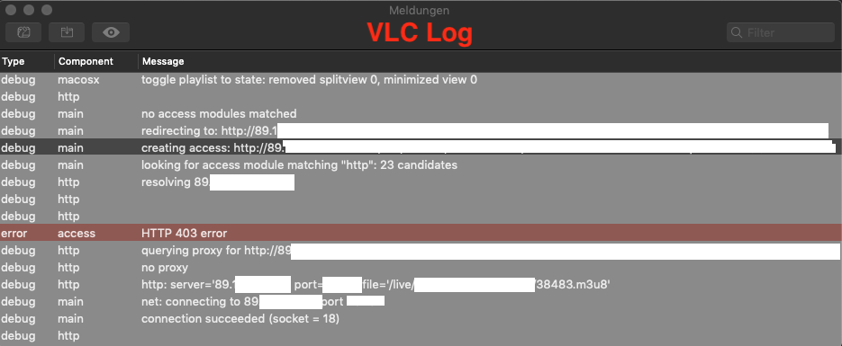

# Troubleshooting

* [General](#general)
* [xTeVe](#xteve)
* [Plex](#plex)

### General
#### DVR Guide is suddenly empty.
Plex and Emby will only display EPG data if it is current. If only old data is included, nothing is displayed in the Guide.  
To check an XMLTV file can be opened with a text editor

XMLTV example:
```XML
<programme channel="guide2go.90447.schedulesdirect.org" start="20190608004300 +0000" stop="20190608004500 +0000">
    <title lang="de">Tagesschau</title>
    <sub-title lang="de">vom 08.06.2019, 02:43 Uhr</sub-title>
    <desc lang="de">Diese Sendung berichtet über die aktuellsten und wichtigsten Nachrichten der Bundesrepublik.&#xA;[vom 08.06.2019, 02:43 Uhr]</desc>
    <category lang="en">News</category>
    <category lang="en">Politics</category>
    <category lang="en">Weather</category>
    <episode-num system="original-air-date">2019-06-08</episode-num>
    <icon src="https://s3.amazonaws.com/schedulesdirect/assets/p10414016_b_v8_aa.jpg" height="720" width="480"></icon>
    <icon src="https://s3.amazonaws.com/schedulesdirect/assets/p10414016_b_h10_aa.jpg" height="540" width="960"></icon>
    <video>
        <quality>HDTV</quality>
    </video>
    <audio>
        <stereo>dolby digital</stereo>
    </audio>
    <new></new>
    <live></live>
</programme>
```

> start="YYYYMMDDHHMMSS +0000"

---

### xTeVe
#### Buffer on: Stream is not playing and there are error codes in the log, such as 403
These are [HTTP](https://en.wikipedia.org/wiki/List_of_HTTP_status_codes#4xx_Client_errors) status codes.  
For debugging, it is recommended to open the stream with VLC and open the message window.  
On the Mac:
> Shift + CMD + M


If the error is reproducible also in VLC, the operator of the streaming server should be informed.  


#### Client show an xTeVe error message that no more streams are available.


##### The following should be checked:
1. With activated buffer, each playlist has a separate tuner / stream limit.  
2. The timeout for a channel switch should be increased in the xTeVe settings.  

---

### Plex

##### Plex says:  
##### Device not found. Ensure your device is powered on and connected to your network.

If you're setting up xTeVe for the first time in Plex, that's normal, just restart Plex. If you often have the problem, it's usually a network problem.  
xTeVe is a UPnP server and sends broadcast requests into the IPv4 network. If your server gets the IP address via DHCP, everything should work. If you have assigned the IP address yourself, you must also specify a broadcast address.
UPnP must be allowed in the network and must not be blocked by a firewall.

```
Network:   192.168.0.0/24
Broadcast: 192.168.0.255
```

#### Plex does not play the stream.
Plex DVR is not compatible with all streaming formats, most problems are incompatible audio codecs. In this case it helps to use FFmpeg as a buffer and changed FFmpeg parameters.  
xTeVe Settings -> Stream Buffer = FFmpeg  
FFmpeg Options:
```
-hide_banner -loglevel error -i [URL] -c:a libmp3lame -vcodec copy -f mpegts pipe:1
```
Audio is transcoded to MP3 stereo.  
To check the streams of the source, the xteve.m3u can be tested with VLC.  
VLC: Open Network
```
URL: http://xteve.ip:port/m3u/xteve.m3u
```

#### Plex DVR can not be set up or channels are missing.
In Plex version 1.15 or higher, there is a bug in specifying the XMLTV link (HTTP)
##### Solution:
Use the file path of xteve.xml

The path can be found in the xTeVe log.
```
XEPG: Create XMLTV file (/home/USERNAME/.xteve/data/xteve.xml)
```

---
