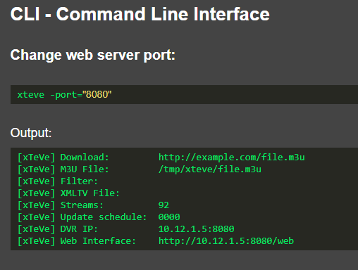

# xTeVe - 设置和配置
## 译者言
译者：[OldTaoge](https://blog.oldtaoge.space/) [网页译本]( https://blog.oldtaoge.space/2021/07/27/oldtaoge-xteve-documentation-zh-cn/ )

在国内,IPTV组播和Web转播有大量的使用,xTeVe在其中发挥了很大的作用.但是这些博客大多没有对xTeVe进行正确配置.

今天

## 设置
#### 运行 xTeVe
* [Windows](#在-windows-上运行)
* [Linux, OS X, FreeBSD](#在其他操作系统上运行)
* [命令行参数](#命令行参数)
* [控制台信息](#控制台信息)
#### xTeVe 配置
* [起步配置](#起步配置)
* [xTeVe 网页接口](#网页接口)
* [播放列表(Playlist)](#播放列表)
* [过滤器(Filter)](#过滤器)
* [XMLTV](#xmltv)
* [映射(Mapping)](#映射)
* [用户(Users)](#用户)
* [设置(Settings)](#设置)
* [日志(Log)](#l日志)
#### 从1.4.4迁移到2.x.x
* [(Migration)](#迁移)
#### M3U
* [M3U 导出](#m3u-导出)
#### API接口
* [API 文档](#api)
## 脚本
* [Linux 启动脚本](scripts.md#linux-systemd)
* [FreeBSD 启动脚本](scripts.md#freebsd-service)
## 故障排除
* [一般](troubleshooting.md#general)
* [xTeVe](troubleshooting.md#xteve)
* [Plex](troubleshooting.md#plex)
## 在 Windows 上运行
xteve.exe 是一个二进制文件,需要双击来运行.
## Xteve 作为 Windows 服务
1. 下载NSSM: https://nssm.cc/release/nssm-2.24.zip
2. 解压并复制 NSSM 到 C:\windows\System32 folder
3. 打开一个命令提示行
4. 运行以下命令: nssm install Xteve
5. Path C:\PathToXteve\xteve.exe
6. Startup directory C:\PathToXteve
7. 参数 (如果有) : -config=C:\PathToXteve\Config or -port="XXXX" (For XXXX use the port you desire)
8. 点击安装服务.
9. 从命令提示行运行这个命令: nssm start Xteve
10. Xteve 应该已经以一个服务运行.
## 在其他操作系统上运行
**Linux, OS X, FreeBSD**
xTeVe 二进制必须在命令行中启动
- 打开命令行
- 切换路径到二进制文件
```
cd /path/to/xteve/folder/
```
- 设置权限来执行文件
```
chmod +x xteve
```
- 启动 xTeVe
```
./xteve
```
## 命令行参数
参数 (如果有) :
1. -config=C:\PathToXteve\Config
2. -port="XXXX" (把 XXXX 换成想要的端口)

## 控制台信息
启动xTeVe之后, 所有重要的信息将被显示在屏幕上
```
[xTeVe] Version:              2.0.0
[xTeVe] System IP Addresses:  IPv4: 2 | IPv6: 8
[xTeVe] Hostname:             xteve.local
[xTeVe] System Folder:        /home/USERNAME/.xteve/
[xTeVe] Load Settings:        /home/USERNAME/.xteve/settings.json
[xTeVe] Temporary Folder:     /tmp/xteve/2019-07-JWZ0-1UT12H/
[xTeVe] UUID:                 2019-07-JWZ0-1UT12H
...
[xTeVe] Web Interface:        http://192.168.178.40:34400/web/
...
```
**System IP Addresses:** 系统可用的IP地址的数量. xTeVe可以通过所有的IP地址到达.
**System Folder:** 这个文件夹储存了所有的配置文件.
**Temporary Folder:** 这个文件夹储存了临时文件. 每个xTeVe实例都有自己的序列号并且创建自己的临时文件夹.
**UUID:** xTeVe 实例的序列号.
**Web Interface:** 这是可以访问 xTeVe Web 界面的 URL/链接. 可以使用计算机的任何其他 IP 地址或主机名.
## 起步配置
- 打开浏览器
- 打开出现在xTeVe 控制台上的链接
```
...
[xTeVe] Web Interface:        http://192.168.178.40:34400/web/
...
```
### 配置向导

#### tuners 的数量
xTeVe 为 Plex 和 Emby 模仿了一个DVR tuner .  
tuner 的数量决定了有多少并发流可用. 一些流提供者只允许一定数量的并行流,那么应该选择这个值.
#### EPG 源
选择 EPG（电子节目指南）源.
**PMS:**
- xTeVe 不处理 EPG 数据
- EPG 数据的配置由 Plex / Emby 完成
**XEPG:**
- xTeVe 以 XMLTV 文件的形式提供 EPG 数据
- 必须至少指定一个 XMLTV 文件作为源
- 频道管理
- xTeVe 为 VLC 等其他视频播放器创建 M3U 播放列表.
#### M3U Playlist
指定本地或来自 Web 服务器的 M3U 播放列表
本地路径:
```
/path/to/playlist.m3u
```
Web 服务器:
```
http://example.com/playlist.m3u
```
#### XMLTV File
**只在 XEPG 下有效**
指定本地或来自 Web 服务器的 XMLTV 文件.
本地路径:
```
/path/to/xmltv.xml
```
Web 服务器:
```
http://example.com/xmltv.xml
```
## 网页接口
### EPG 源: PMS

### EPG 源: XEPG

#### xTeVe 概览
**xTeVe:** 版本号
**UUID:** xTeVe 实例的序列号
**Available Streams:** 可用流/所有流
如果可用流为 0, 限制的数量是480个,并且[过滤器](#过滤器) 必须被使用
**XEPG Channels:** 已分配给映射菜单中 XMLTV 文件的活动频道. （仅限 XEPG）
**OS:** 操作系统
**Arch:** 处理器架构
**EPG Source:** EPG数据的[源](#general) (PMS 或者 XEPG)
**DVR IP:** DVR 调谐器地址. Plex 和 Emby (HDHR) 需要
**M3U URL:** 其他视频播放器（如 VLC 等）的 M3U 播放列表的 HTTP URL（仅限 XEPG）
**XEPG URL:** 用于 Plex, Emby 或其他IPTV应用程序的XMLTV网址.（仅限 XEPG）
**Download as GZIP:** `http://xeteve.ip:34400/xmltv/xteve.xml.gz`
IPTV 客户端必须支持 EPG 数据的 GZIP（Plex不支持 GZIP）)
**Errors:** 已发生的错误.显示在日志中.
**Warnings:** 系统警告.显示在[日志](#log).中.

## 播放列表
支持 M3U 播放列表和HDHomeRun tuners
#### 概述播放列表
**Playlist:** 播放列表名称
**Tuner:** 此播放列表的并发流数.仅[缓冲区](#streaming)当激活时
**Last Update:** 播放列表上次更新的时间
**Availability %:** 播放列表的可用性.
**Type:** 播放列表类型 (M3U 或 HDHomeRun).
**Streams:** 播放列表中的流数.
**group-title %:** 播放列表中有分组的流百分比.
M3U 参数称为`group-title="Group name"`.
分配组的流可以更容易地过滤.
**tvg-id %:** 引用了 XMLTV 频道的流的百分比, M3U 参数称为`tvg-id="example.com"`
带有此参数的流会自动分配到映射菜单中的 XMLTV 频道. 自动分配仅执行新通道,并且仅自动执行一次
**Unique ID %:** 即使频道名称发生变化,也可以更可靠地分配具有唯一 ID 的流.对于频道名称定期更改的流很有帮助.此 ID 的工作方式类似于数据库 ID
它没有官方参数,大多数情况下参数是`CUID="1234",channel-id="abcd"`.
xTeVe 分析每个流以找到 ID, 即使参数不同
如果流不包含此 ID,则通道名称用于通道分配.如果频道名称在更新期间更改,则这是新频道,旧频道将被删除
#### 添加一个播放列表
点击 **New** 添加新的播放列表或调谐器 tuner.
**类型**  
- M3U: M3U playlist
- HDHomeRun: HDHomeRun Tuner

**Name:** 播放列表名称
**Description:** 播放列表说明
**M3U File:** 播放列表的 [URL](#m3u-playlist) 或者本地 [路径](#m3u-playlist)
**HDHomeRun IP:** HDHomeRun tuner 的 IP 地址和端口。端口可能因型号和固件而异。
```
192.168.178.5:5004
```
**Tuner / Streams:** 此播放列表的并发流数。仅与 **激活的** [缓冲区](#buffer) 一起使用
当超过限制时，不会与流媒体服务器/提供商建立连接。客户端（Plex、Emby、xteve.m3u）收到错误消息作为视频流。

#### 编辑播放列表
通过单击概览中的播放列表，可以对其进行编辑。
**Save：** 保存此播放列表
**Update：** 播放列表正在更新
**Cancel：** 取消
**Delete：** 删除此播放列表
## 过滤器
为了减少流的数量，可以创建过滤规则。
有两种类型的过滤器：
- [群组过滤器](#group-filter): 基于 M3U 的群组标题 (`group-title="群组名称"`)
- [自定义过滤器](#custom-filter): 分析所有 M3U 参数，基于值可以创建过滤规则。
#### 过滤器概览
**Filter Name:** 过滤器名
**Filter Type:** 类型 (Group 或 Custom)
**Filter:** 过滤器规则
#### 创建一个新的过滤器
点击 **New** 新建一个过滤器
**类型**

- M3U: 组名
- xTeVe: 自定义过滤器
#### 组过滤器

**Filter Name:** 过滤器名
**Description:** 说明
**Group Title:** 选择一个组或 HDHomeRun tuner. 一次只能选择一组/调谐器。对于另一个组，必须创建一个新过滤器.
括号中的数字表示该组中有多少个流。
**Case Sensitive:** 区分大小写
**Include:** 频道名称必须包含这些词之一。
用逗号分隔，可以指定多个单词。要使用此频道，必须包含这些词之一。
**Exclude:** 频道名称不能包含这些词中的任何一个。
用逗号分隔，可以指定多个单词。如果包含这些词之一，则该频道将被挑出
#### 自定义过滤器

**Filter Name:** 过滤器名
**Description:** 说明
**Case Sensitive:** 区分大小写
**Filter Rule:** 过滤器规则
M3U playlist 的例子:
```
#EXTM3U
#EXTINF:-1 CUID="1000" tvg-id="news.channel.1" tvg-name="News Channel 1" tvg-logo="http://example.com/logo1.jpg" group-title="UK: News",News Channel 1 HD
http://example.com/stream1.ts
#EXTINF:-1 CUID="1001" tvg-id="news.channel.2" tvg-name="News Channel 2" tvg-logo="http://example.com/logo2.jpg" group-title="UK: News",News Channel 2 SD
http://example.com/stream2.ts
#EXTINF:-1 CUID="1002" tvg-id="news.channel.3" tvg-name="News Channel 3" tvg-logo="http://example.com/logo3.jpg" group-title="US: News",News Channel 3 HD
http://example.com/stream3.ts
#EXTINF:-1 CUID="1003" tvg-id="sports.channel.1" tvg-name="Sports Channel 1" tvg-logo="http://example.com/logo4.jpg" group-title="UK: Sports",Sports Channel 1 HD
http://example.com/stream4.ts
```
xTeVe 分析每个流的所有 M3U 参数并将这些值放在一起。 URL 被排除在外。 流的值如下所示：
```
Stream 1:
1000 news.channel.1 News Channel 1 UK: News News Channel 1 HD
Stream 2:
1001 news.channel.2 News Channel 2 UK: News News Channel 2 SD
Stream 3:
1002 news.channel.3 News Channel 3 US: News News Channel 3 HD
Stream 4:
1003 sports.channel.1 Sports Channel 1 UK: Sports Sports Channel 1 HD
```
所有新闻频道的过滤规则如下所示：
```
News
```
由于`news`一词包含在流 1、2、3 的几个 M3U 参数中，因此仅过滤了这三个流。

---

其中三个流在 M3U 组标题中包含`UK:`。要过滤所有包含 `UK:` 的流，过滤规则如下所示：
```
UK:
```
---

要指定更多条件，可以使用大括号。
> 包括 {VIP,HD}
> 排除 !{ES,FR}
> 如果您只想过滤标记为 **HD** 的 **News** 频道，则规则如下所示：
```
News {HD}
```
Stream 1 和 3 现在可用
要排除美国频道，过滤规则如下所示：
```
News {HD} !{US}
```
Stream 1 现在可用

---
过滤规则的坏主意：
```
!{That's,not,a,good,idea,for,a,filter,rule}
```
任何包含这些词之一的流都将被删除。由于字母 `a` 包含在单词 Ch**a**nnel 中，因此没有可用的流。
## XMLTV
**仅适用于 XEPG**
支持使用 UTF-8 编码的 XMLTV 文件。 XMLTV 文件是包含 EPG（电子节目指南）数据的 XML 文件。
#### 概述 XMLTV
**Guide:** 指南名称
**Last Update:** 指南在此时最后更新。
**Availability %:** 此文件的可用性。在百分比。
**Channels:** 此文件中的可用频道。
**Programs:** 此文件中节目信息的数量。
#### 添加新的 XMLTV 文件
单击 **New** 以添加新的 XMLTV 文件。

**Name:** 指南名称
**Description:** 指南说明
**XMLTV File:** XMLTV 文件的 [URL](#xmltv-file) 或本地 [路径](#xmltv-file)
#### 编辑 XMLTV 文件
通过单击概览中的指南，可以对其进行编辑。
**Save:** 保存 XMLTV 文件
**Update:** 更新XMLTV 文件
**Cancel:** 取消
**Delete:** 删除此 XMLTV 文件
## 映射
** 仅适用于 XEPG **
映射功能允许您从播放列表编辑频道。
只有活动频道（绿色）会传递给 Plex、Emby 和 xteve.m3u 播放列表。
要使频道处于活动状态，必须将其分配给 XMLTV 频道。新渠道，例如如果 M3U 和 XMLTV 文件中的 ID 匹配，新的过滤规则会自动分配一个 XMLTV 文件。
> tvg-id (M3U) == 频道 id (XMLTV)
> 新频道获得1000后第一个免费频道号。
> 如果某个频道没有可用的 EPG 数据，则可以使用 [xTeVe Dummy](#xteve-dummy)。
> 
> **Save:** 频道的所有设置都会被保存，xTeVe 会生成 DVR 阵容、xteve.xml 和 xteve.m3u 文件。创建这些文件是在后台完成的，可能需要几秒钟的时间。
> **Bulk Edit:** 允许使用相同的设置编辑多个通道，例如EPG 类别。
> **Search:** 可以搜索以下术语。
- 频道名称
- 频道位置
- 组标题
- 类别
- XMLTV 文件
- 频道状态（在线/离线）
**功能:**
- 更改通道编号，从而更改 Plex、Emby 和 M3U (xteve.m3u) 中的通道序列 。通过点击频道号，可以更改它。
- 更改频道标志
- 更改频道名称
- 更改 xteve.m3u 播放列表的组标题
- 添加另一个 EPG 类别
- 将播放列表频道分配给 XMLTV 频道
通过单击频道，将打开该频道的编辑模式。

**Active：** 只有在分配了 XMLTV 文件/频道时才能激活频道。
**Channe Name:** 更改频道名称，如果名称中包含**HD**，则xteve.xml文件中该频道的所有节目都声明为HD。
**Channel Description:** 该条目也被 [xTeVe Dummy](#xteve-dummy) 作为 xteve.xml 文件中的程序说明采用。
xteve.xml:
```XML
<programme channel="1000" start="20191213020000 +0100" stop="20191213040000 +0100">
    <title lang="en">Das Erste HD (Fr. 02:00 - 04:00)</title>
    <desc lang="en">This is a description of this channel</desc>
    ...
</programme>
```
如果未输入任何值，则使用默认值。
xteve.xml（默认描述）：
```XML
<programme channel="1000" start="20191213020000 +0100" stop="20191213040000 +0100">
    <title lang="en">Das Erste HD (Fr. 02:00 - 04:00)</title>
    <desc lang="en">xTeVe: (120 Minutes) Friday 02:00 - 04:00</desc>
    ...
</programme>
```
**Update Channel Name:** 如果播放列表中流的频道名称发生变化，频道名称会自动更新。 此功能仅在播放列表中的流具有 [唯一 ID](#overview-playlist) 时可用。
**Logo URL:** 使用图像 URL 更改频道徽标。 通过单击**上传徽标** 按钮，您还可以上传您自己的徽标。 xTeVe 然后通过自己的网络服务器提供这些。
**Update Channel Logo:** 随着播放列表和 XMLTV 文件的每次更新更新频道徽标。 第一优先级是 XMLTV 文件，如果它不包含此频道的徽标，则将使用 M3U 的徽标。
**EPG Category:** 为该频道添加另一个类别。 所有节目信息都使用此类别进行扩展，保留现有类别。 Plex 支持以下类别：
- News
- Movie
- Series
- Sports
如果未在 Provider XMLTV 文件中指定类别，则它是 Plex 的电影。
**Group Title:：** 在 xteve.m3u 中为此频道声明一个组
> xteve.m3u - M3U 参数：group-title="THIS_GROUP_TITLE"
> **XMLTV File:** XMLTV 文件的选择
> **XMLTV Channel:** XMLTV 频道的选择
> 通过单击完成按钮，设置被接受，但尚未保存。
---
文本编辑器可用于通过打开 XMLTV 文件来检查提供程序是否已支持类别。
XMLTV 示例：
```XML
<?xml version="1.0" encoding="UTF-8"?>
  <tv source-info-url="http://schedulesdirect.org" generator-info-name="guide2go" source-info-name="Schedules Direct">
    <channel id="guide2go.90447.schedulesdirect.org">
        <display-name>ARDGRHD</display-name>
        <display-name>Das Erste HD</display-name>
        <icon src="https://s3.amazonaws.com/schedulesdirect/assets/stationLogos/s90447_h3_aa.png" height="270" width="360"></icon>
    </channel>
    <programme channel="guide2go.90447.schedulesdirect.org" start="20190608004300 +0000" stop="20190608004500 +0000">
        <title lang="de">Tagesschau</title>
        <sub-title lang="de">vom 08.06.2019, 02:43 Uhr</sub-title>
        <desc lang="de">Diese Sendung berichtet über die aktuellsten und wichtigsten Nachrichten der Bundesrepublik.
[vom 08.06.2019, 02:43 Uhr]</desc>
        <category lang="en">News</category>
        <category lang="en">Politics</category>
        <category lang="en">Weather</category>
        <episode-num system="original-air-date">2019-06-08</episode-num>
        <icon src="https://s3.amazonaws.com/schedulesdirect/assets/p10414016_b_v8_aa.jpg" height="720" width="480"></icon>
        <icon src="https://s3.amazonaws.com/schedulesdirect/assets/p10414016_b_h10_aa.jpg" height="540" width="960"></icon>
        <video>
            <quality>HDTV</quality>
        </video>
        <audio>
            <stereo>dolby digital</stereo>
        </audio>
        <new></new>
        <live></live>
    </programme>
  </tv>
```
#### xTeVe Dummy
xTeVe dummy 生成接下来 5 天的 EPG 数据。因此，可以分配没有 EPG 数据可用的频道。作为节目信息，使用频道名称和设置的节目长度。

## 用户
通过用户认证和权限可以锁定不同的功能。要使此菜单项可用，必须首先在 [设置](#authentication) 中激活此功能。可以通过 **New** 按钮添加新用户。已设置的第一个用户不可删除，始终拥有授权WEB
通过单击用户名，可以更改密码和权限。
对所选用户的以下授权是可能的：
- WEB：允许登录到 xTeVe 网络界面
- PMS：允许加载 DVR Linups，此功能仅支持 Plex。凭据将添加到 DVR 地址。
> DVR IP：用户名：密码@192.168.178.40:34400
- M3U：允许您下载 xteve.m3u 播放列表。凭据将添加到 M3U URL。
> M3U网址：http://192.168.178.40:34400/m3u/xteve.m3u?username=xxx&password=yyy
- XML：允许您下载 xteve.xml 文件。凭据将添加到 XEPG URL。
> XEPG 网址：http://192.168.178.40:34400/xmltv/xteve.xml?username=xxx&password=yyy
- API：允许访问 [API](#api) 接口。
**Save:** 保存用户设置
**Cancel:** 取消，不保存更改
**Delete:** 删除用户
##设置
#### 一般
- **Automatic update of xTeVe:** 定期检查是否有新版本可用。将自动安装更新。 xTeVe 需要对二进制文件所在文件夹的写权限。更新从 GitHub 下载。
- **Number of tuners:** xTeVe 提供的调谐器数量。由 Plex、Emby HDHR 和 xteve.m3u 使用（仅启用缓冲区）。如果缓冲区被激活，每个播放列表/调谐器的调谐器限制可以单独设置。调谐器限制应该是播放列表中所有调谐器限制的总和。
- **EPG Source:** EPG（电子节目指南）来源的选择。
- **API Interface:** 激活[API](#api)接口
#### 文件
- **Schedule for updating:** 所有播放列表、调谐器和 XMLTV 文件应更新的时间。
- **Updates all files at startup:** 在 xTeVe 启动时更新所有播放列表、调谐器和 XMLTV 文件。
- **Location for the temporary files:** 存储临时文件的路径。
- **Image caching:** 下载并保存 XMLTV 文件中所有必需的图像。启用客户端更快的 EPG 查询。
- **Replace missing program images:** 如果 XMLTV 文件中没有海报，将使用频道徽标。
对于 FFmpeg 和 VLC，必须安装通用程序并指定程序的路径。
```
Streaming Server (Provider) --> (xTeVe / FFmpeg / VLC) --> Plex / Emby / xteve.m3u
```
如果禁用缓冲区，则仅将流 URL 传递给客户端。然后不再涉及 xTeVe。
- **UDPxy** 这允许 xTeVe 通过 [UDPxy](http://udpxy.com) 代理播放列表中存在的多播流。 UDPxy 是数据流中继，能够监听组播UDP 流并提供tcp 单播流。
设置后，播放列表中存在的每个多播流 URL（即以 udp://@ 开头的流）都将被重写以通过配置的 UDPxy 服务器进行代理，而不管缓冲区设置如何。例如，如果Stream Buffer设置为none，那么重写后的url会传递给请求的；如果设置为 ffmpeg，则 ffmpeg 将被指示访问通过 UDPxy 的视频流。
- **Buffer Size:** 缓冲区的大小。如果 HLS 段的大小小于缓冲区大小，则 HLS 段将使用该大小。
- **Timeout for new client connections:** xTeVe 在允许新连接之前等待设置的时间。有助于快速频道切换。
- **User Agent:** 定义哪个用户代理应该位于 HTTP 连接和缓冲区的标头中。
- **FFmpeg Binary Path:** FFmpeg 的文件路径。
- **FFmpeg Options:** FFmpeg 选项，在默认设置下没有流被转码，只有重新混合。更多参数可在 [此处](https://ffmpeg.org/ffmpeg.html)
- **VLC Binary Path:** VLC 或 CVLC 的文件路径。
- **VLC Options:** VLC 选项，在默认设置下没有流被转码，只有重新混合。更多参数可用 [此处](https://wiki.videolan.org/Documentation:Command_line/)
#### 备份
- **Location for automatic backups:** 自动备份的位置。 xTeVe 需要此文件夹的写权限
- **Number of backups to keep:** 要保留的备份数。较旧的备份会自动删除。
#### 认证
- **WEB Authentication:** 只能使用凭据访问 Web 界面。
- **PMS Authentication:** 仅可使用凭据访问 DVR 阵容。此功能仅支持 Plex。
- **M3U Authentication:** 只能使用凭据访问 xteve.m3u 播放列表。
- **XML Authentication:** 只能使用凭据访问 xteve.xml 文件。
- **API Authentication:** 只能使用凭据访问 [API](#api) 接口。
在[用户设置](#users) 中，必须为用户分配授权。
## 日志

显示 xTeVe 日志并每 10 秒刷新一次。所有条目都在 RAM 中。日志最多 500 个条目，旧条目将被删除。按钮 **Empty Log** 删除日志，重置警告和错误。

---

## 迁移
二进制文件必须有执行权限。
**网页界面:**
1. 备份 1.4.4 (Settings -> Backup)
2. 停止 xTeVe 1.4.4
3. 启动 xTeVe 2.x.x
4. 通过向导
5. 恢复1.4.4的配置 (Setting -> Restore -> Select backup file)
**命令行 - CLI**
1.打开终端
2.进入xTeVe二进制文件所在的文件夹
```
cd /path/to/xteve/folder/
```
3. 恢复备份文件
```
./xteve -restore /path/to/backup/xteve_backup_YYYYMMDD_HHMM.zip
```
4. 启动 xTeVe

---

## M3U-导出
在[settings](#settings)中，EPG源必须设置为XEPG。
映射菜单中的所有活动频道都导出到 M3U 播放列表。
组标题和频道名称可以在[映射](#mapping) 菜单中更改。
播放列表可以通过以下 URL 下载。
**无用户身份验证**
``
http://xteve.ip:port/m3u/xteve.m3u
``
**使用用户身份验证**
用户必须有授权M3U。
``
http://xteve.ip:port/m3u/xteve.m3u?username=xxx&password=yyy
``
**导出特定组的频道**
在本例中，仅导出 **foo** 和 **bar** 组的活动通道：
``
http://xteve.ip:port/m3u/xteve.m3u?group-title=foo,bar
``
相同的示例,使用用户验证：
``
http://xteve.ip:port/m3u/xteve.m3u?username=xxx&password=yyy&group-title=foo,bar
``
## API
通过 API 接口，可以向 xTeVe 发送命令。 要使用 API，必须在 [settings](#general) 中启用它。
所有 API 请求都是通过 HTTP 请求作为正文中的 JSON 字符串发出的。
仅当 xTeVe 完成命令时才会出现响应。
如果API接口的认证被激活，首先要做的是登录。用户需要授权[API]。

#### API - 登录
**URL**: http://xteve.ip:port/api/
**Method:** POST
**Request:** 需要授权
```JSON
{
  "cmd": "login",
  "username": "username",
  "password": "password"
}
```
**Response:**
```JSON
{
  "status": true,
  "token": "tYKJs7WPP3gDOyM_Ggh3El4ZB5tEcGk78oAxrdjw",
}
```
**token:** 这是一次性令牌，仅有效一次且仅 60 分钟。对于每个 API 请求，必须指定令牌并返回新令牌。
#### API - xTeVe 状态
**URL**: http://xteve.ip:port/api/
**Method:** POST
**Request:** 需要授权
```JSON
{
  "cmd": "status",
  "token": "tYKJs7WPP3gDOyM_Ggh3El4ZB5tEcGk78oAxrdjw"
}
```
**Response:**
```JSON
{
  "epg.source": "XEPG",
  "status": true,
  "streams.active": 2,
  "streams.all": 21,
  "streams.xepg": 2,
  "token": "IRRJDevtK4s7ec4-3gLw7uswtCVqC9DWngH4Jxzv",
  "url.dvr": "192.168.178.40:34400",
  "url.m3u": "http://192.168.178.40:34400/m3u/xteve.m3u",
  "url.xepg": "http://192.168.178.40:34400/xmltv/xteve.xml",
  "version.api": "1.1.0",
  "version.xteve": "2.0.0"
}
```
**token:** 这是一种新的一次性令牌.
如果禁用身份验证，则不需要指定令牌。
#### API - 更新所有 M3U 播放列表并应用过滤器
**URL**: http://xteve.ip:port/api/  
**Method:** POST  
**Request:** 不需要授权  
```JSON
{
  "cmd": "update.m3u"
}
```
**Response:**
```JSON
{
  "status": true
}
```
#### API - 更新所有 HDHomeRun tuner并应用过滤器
**URL**: http://xteve.ip:port/api/  
**Method:** POST  
**Request:** 不需要授权  
```JSON
{
  "cmd": "update.hdhr"
}
```
**Response:**
```JSON
{
  "status": true
}
```
#### API - 更新所有 XMLTV 文件
**URL**: http://xteve.ip:port/api/  
**Method:** POST  
**Request:** 不需要授权  
```JSON
{
  "cmd": "update.xmltv"
}
```
**Response:**
```JSON
{
  "status": true
}
```
#### API - 更新 XEPG（映射, xteve.xml, xteve.m3u）
**URL**: http://xteve.ip:port/api/  
**Method:** POST  
**Request:** 不需要授权  
```JSON
{
  "cmd": "update.xepg"
}
```
**Response:**
```JSON
{
  "status": true
}
```
#### API - 错误结果
**Response:**
```JSON
{
  "err": "Invalid API command",
  "status": false
}
```